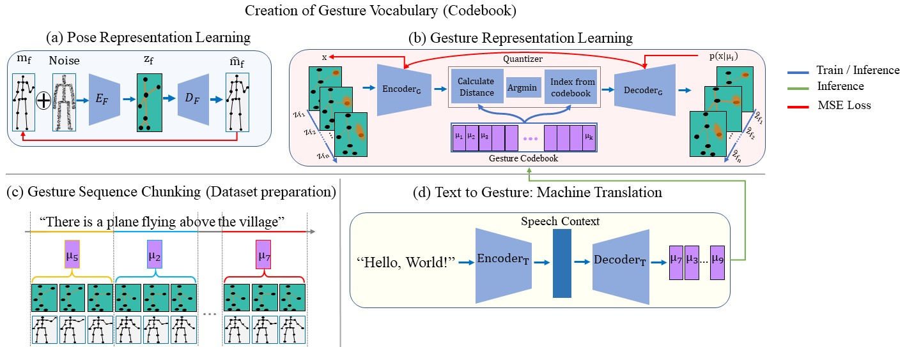

# Gesture2Vec: Clustering Gestures using Representation Learning Methods for Co-speech Gesture Generation

## The Best Paper Award Winner in Cognitive Robotics at  IROS2022

This is an official PyTorch implementation of *Gesture2Vec: Clustering Gestures using Representation Learning Methods for Co-speech Gesture Generation* (IROS 2022). In this paper, we present an automatic gesture generation model that uses a vector-quantized variational autoencoder structure as well as training techniques to learn a rigorous representation of gesture sequences. We then translate input text into a discrete sequence of associated gesture chunks in the learned gesture space. Subjective and objective evaluations confirm the success of our approach in terms of appropriateness, human-likeness, and diversity. We also introduce new objective metrics using the quantized gesture representation.

### [PAPER](https://sfumars.com/wp-content/papers/2022_iros_gesture2vec.pdf) | [Demo VIDEO](https://www.youtube.com/watch?v=ac8jWk4fdCU) | [Presentation](https://youtu.be/qFObMpOboCg)

## Demo Video

 

## Presentation

 

### The code instrauction is coming soon. Stay tuned!

## License
This code is distributed under an [MIT LICENSE](LICENSE).

Note that our code uses datasets inluding Trinity and Talk With Hand (TWH) that each have their own respective licenses that must also be followed.

Please feel free to contact us (pjomeyaz@sfu.ca) with any question or concerns.
